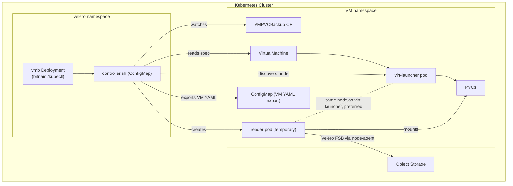
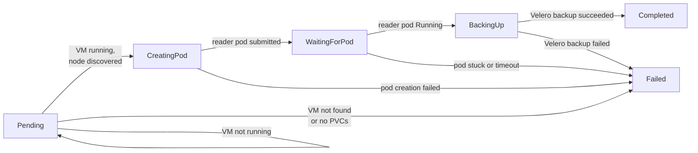
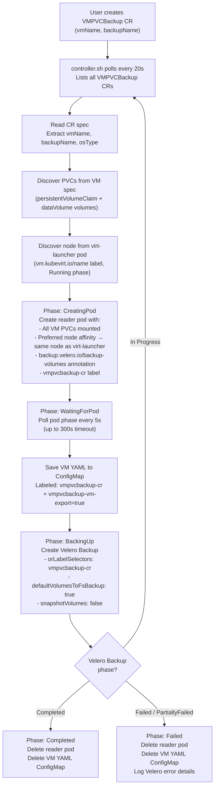
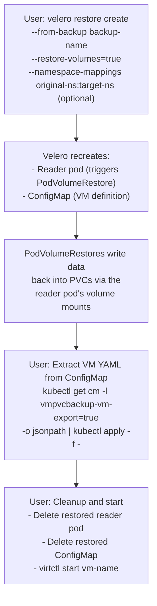
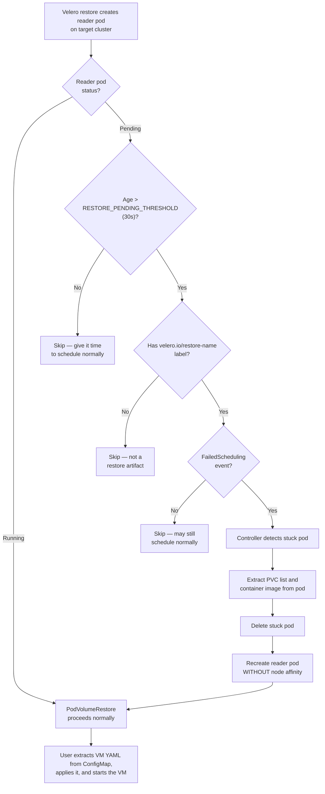
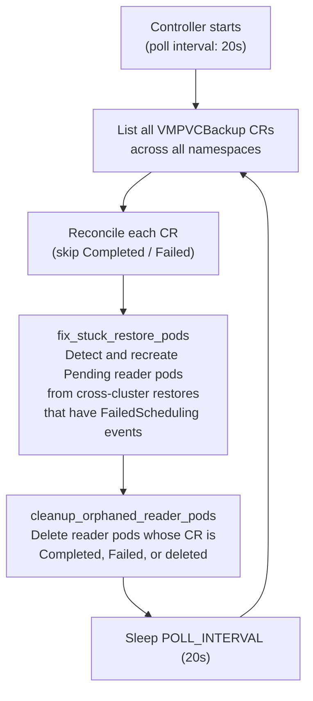

# KubeVirt VM PVC Backup (VMPVCBackup)

A Kubernetes-native controller and CRD for backing up and restoring **running KubeVirt virtual machine** PVCs using Velero file-system backup — without shutting down the VM.

---

## Table of Contents

- [The Problem](#the-problem)
- [How It Works](#architecture-diagram)
  - [Backup Flow](#backup-flow)
  - [Restore Flow](#restore-flow)
  - [Cross-Cluster Restore](#cross-cluster-restore)
- [Architecture Diagram](#architecture-diagram)
- [Prerequisites](#prerequisites)
- [Installation](#installation)
- [Usage](#usage)
  - [Backup a Linux VM](#backup-a-linux-vm)
  - [Backup a Windows VM](#backup-a-windows-vm)
  - [Monitor Backup Progress](#monitor-backup-progress)
  - [Restore](#restore)
- [Resource Reference](#resource-reference)
  - [CustomResourceDefinition — VMPVCBackup](#1-customresourcedefinition--vmpvcbackup)
  - [ServiceAccount, ClusterRole, ClusterRoleBinding — RBAC](#2-serviceaccount-clusterrole-clusterrolebinding--rbac)
  - [ConfigMap — Controller Script](#3-configmap--controller-script)
  - [Deployment — Controller](#4-deployment--controller)
- [Controller Script — Detailed Breakdown](#controller-script--detailed-breakdown)
  - [Global Settings](#global-settings)
  - [Helper Functions](#helper-functions)
  - [Core Reconcile Logic](#core-reconcile-logic)
  - [Restore Assist — fix_stuck_restore_pods](#restore-assist--fix_stuck_restore_pods)
  - [Orphan Sweep — cleanup_orphaned_reader_pods](#orphan-sweep--cleanup_orphaned_reader_pods)
  - [Main Loop](#main-loop)
- [CR Spec Reference](#cr-spec-reference)
- [Status Fields](#status-fields)
- [Troubleshooting](#troubleshooting)
- [Limitations](#limitations)

---

## The Problem

Velero's file-system backup (FSB) requires a **running pod** with the PVC mounted to perform the backup. KubeVirt VMs use PVCs through `virt-launcher` pods, but:

 Velero's FSB cannot back up PVCs mounted by `virt-launcher` pods directly — the pod internals are managed by KubeVirt and don't expose standard mount paths.

**The workaround:** Mount the VM's PVCs onto a temporary **reader pod** on the same node, back up through that pod using Velero FSB, then clean up. This controller automates that entire workflow.

---

## Architecture Diagram

### Cluster Architecture



### CR Status Phases



### Backup Flow



### Restore Flow



### Cross-Cluster Restore



## Main Reconciliation Loop




---

## Prerequisites

| Requirement | Details |
|---|---|
| **Kubernetes** |  |
| **KubeVirt** |  |
| **Velero** | with a file-system backup provider (restic or kopia) |
| **Velero node-agent** | DaemonSet must be running (`velero install --use-node-agent`) |
| **kubectl** | Available on the machine where you apply manifests |
| **virtctl** | (Optional) For starting/stopping VMs |
| **Object storage** | Configured as a Velero BackupStorageLocation (S3, GCS, MinIO, etc.) |

Verify Velero is working:

```bash
# Velero server is running
kubectl get deployment -n velero

# Node-agent is deployed on all nodes
kubectl get daemonset -n velero

# BackupStorageLocation is available
velero backup-location get
```

---

## Installation

**Step 1 — Clone the repository:**

```bash
git clone https://github.com/code-lover636/Kubevirt-VM-Backup.git
cd Kubevirt-VM-Backup
```

**Step 2 — Review the manifest:**

The entire solution is in a single file. Open it and verify the `velero` namespace matches your setup:

```bash
cat vmpvcbackup.yaml
```

**Step 3 — Apply the manifest:**

```bash
kubectl apply -f vmpvcbackup.yaml
```

This creates all four resources at once:
- The `VMPVCBackup` CRD
- RBAC (ServiceAccount, ClusterRole, ClusterRoleBinding)
- The controller script ConfigMap
- The controller Deployment

**Step 4 — Verify the controller is running:**

```bash
kubectl get deployment vmb -n velero
kubectl logs -n velero -l app=vmb -f
```

You should see:

```
[2026-03-26 00:00:00] [INFO]  VMPVCBackup controller started (poll interval: 20s)
```

**Step 5 — Verify the CRD is registered:**

```bash
kubectl get crd vmpvcbackups.backup.kubevirt.io
```

---

## Usage

### Backup a Linux VM

**1. Ensure the VM is running:**

```bash
kubectl get vmi -n <namespace>
```

**2. Create a VMPVCBackup CR:**

```yaml
apiVersion: backup.kubevirt.io/v1alpha1
kind: VMPVCBackup
metadata:
  name: myvm-backup-1         # name of the CR
  namespace: default          # must match the VM's namespace
spec:
  vmName: my-linux-vm         # name of the VirtualMachine object
  backupName: myvm-velero-1   # name for the Velero Backup
```

```bash
kubectl apply -f backup-cr.yaml
```

**3. Watch the logs:**
```bash
kubectl logs -n velero -l app=vmb -f
```


### Backup a Windows VM

```yaml
apiVersion: backup.kubevirt.io/v1alpha1
kind: VMPVCBackup
metadata:
  name: winvm-backup-1
  namespace: vms
spec:
  vmName: my-windows-vm
  backupName: winvm-velero-1
  osType: windows               # uses servercore image + windows mount paths
```

### Monitor Backup Progress

```bash
# CR status (short form)
kubectl get vmpb -A

# Detailed status
kubectl describe vmpvcbackup myvm-backup-1 -n default

# Controller logs
kubectl logs -n velero -l app=vmb -f

# Underlying Velero backup
velero backup describe myvm-velero-1 --details
```

### Restore


```bash
# Step 1 — Create Velero restore
velero restore create --from-backup myvm-velero-1 --restore-volumes=true --wait

# Step 2 — Wait for PodVolumeRestores to complete
kubectl get podvolumerestores -n velero -w

# Step 3 — Recreate the VM from the saved ConfigMap
kubectl get configmap -n default -l vmpvcbackup-vm-export=true \
  -o jsonpath='{.items[0].data.vm\.yaml}' | kubectl apply -f -

# Step 4 — Start the VM
virtctl start my-linux-vm -n default
```
---

## Resource Reference

### 1. CustomResourceDefinition — VMPVCBackup

Registers the `VMPVCBackup` custom resource in the `backup.kubevirt.io` API group. This is the user-facing API — you create a VMPVCBackup object to trigger a backup. The CRD defines the `.spec` fields (vmName, backupName, osType, veleroNamespace) and `.status` fields (phase, readerPodName, targetNode, etc.) along with printer columns so `kubectl get vmpb` shows useful information at a glance.

### 2. ServiceAccount, ClusterRole, ClusterRoleBinding — RBAC

The controller runs as the `vmb` ServiceAccount in the `velero` namespace. The ClusterRole grants it permission to:

- **Get, list, watch** VMPVCBackup CRs and **update, patch** their status subresource
- **Get, list, create, delete, watch** pods (reader pods), PVCs, and ConfigMaps (VM YAML export)
- **Get, list, patch** VirtualMachines and VirtualMachineInstances (for discovering PVCs and node)
- **Get, list** DataVolumes (CDI metadata)
- **Get, list, watch, create** Velero Backups, Restores, and PodVolumeRestores

The ClusterRoleBinding binds this role to the `vmb` ServiceAccount across all namespaces.

### 3. ConfigMap — Controller Script

Contains `controller.sh` — the entire controller logic in a single Bash script. Mounted into the controller pod at `/scripts/controller.sh`. This is where all the automation logic lives: discovery, pod creation, Velero integration, cleanup, and restore assistance.

### 4. Deployment — Controller

A single-replica Deployment in the `velero` namespace that runs the `bitnami/kubectl` image with the controller script. It uses the `vmb` ServiceAccount for API access. The pod mounts the script ConfigMap and simply executes `controller.sh` as its entrypoint.

---

## Controller Script — Detailed Breakdown

The controller is a polling-based reconciliation loop written in Bash. Every 20 seconds it lists all VMPVCBackup CRs, reconciles each one, then runs restore-assist and orphan cleanup.

### Global Settings

| Variable | Default | Purpose |
|---|---|---|
| `POLL_INTERVAL` | `20` | Seconds between reconciliation cycles |
| `POD_READY_TIMEOUT` | `300` | Max seconds to wait for reader pod to become Running |
| `RESTORE_PENDING_THRESHOLD` | `30` | Seconds a restored reader pod must be Pending before the controller intervenes |

### Helper Functions

**`patch_status(name, ns, phase, msg)`**
Updates the CR's `.status.phase` and `.status.message` via a JSON merge patch on the status subresource. Failures are logged but don't halt the controller.

**`discover_pvcs(vm_name, ns)`**
Reads the VirtualMachine spec and extracts PVC names from two sources:
- `.spec.template.spec.volumes[*].persistentVolumeClaim.claimName` — direct PVC references
- `.spec.template.spec.volumes[*].dataVolume.name` — CDI DataVolume references (the DataVolume name equals the PVC name)

Results are deduplicated and returned as a space-separated string.

**`discover_node(vm_name, ns)`**
Finds the node where the VM is running by looking up the `virt-launcher` pod with label `vm.kubevirt.io/name=<vmName>` in Running state and extracting `.spec.nodeName`.

**`build_backup_vols_annotation(pvcs...)`**
Generates the `backup.velero.io/backup-volumes` annotation value. For 3 PVCs this produces `disk1,disk2,disk3` — telling Velero which volumes on the reader pod to back up with FSB.

**`build_volume_mounts(os_type, pvcs...)`** and **`build_volumes(pvcs...)`**
Generate the YAML fragments for `volumeMounts` and `volumes` sections of the reader pod spec. Linux PVCs are mounted at `/data1`, `/data2`, etc. Windows PVCs at `C:/data1`, `C:/data2`, etc.

**`create_reader_pod(pod_name, ns, os_type, target_node, pvcs...)`**
Creates the temporary reader pod with:
- All VM PVCs mounted
- `preferredDuringSchedulingIgnoredDuringExecution` node affinity — prefers the VM's node (required for RWO PVCs) but doesn't hard-require it (so restore on a different cluster still works)
- `backup.velero.io/backup-volumes` annotation
- `vmpvcbackup-cr` label
- For Linux: `ubuntu:22.04` running `sleep infinity` with privileged security context
- For Windows: `servercore:ltsc2022` running a PowerShell sleep loop with `kubernetes.io/os: windows` nodeSelector

**`wait_for_pod(pod_name, ns)`**
Polls the pod phase every 5 seconds up to `POD_READY_TIMEOUT`. Returns 0 on Running, 1 on terminal states (Failed, Error, CrashLoopBackOff) or timeout.

**`verify_pod_node(pod_name, ns, expected_node)`**
Checks if the reader pod actually landed on the expected node. Logs a warning if it didn't (which can happen with RWX PVCs) but continues anyway since RWO PVCs enforce co-location by nature.

**`save_vm_yaml(vm_name, ns, cr_name, pod_name)`**
Exports the complete VirtualMachine YAML to a ConfigMap named `vm-backup-<cr_name>`. This ConfigMap is labeled with `vmpvcbackup-cr` (so Velero includes it) and `vmpvcbackup-vm-export=true` (so the restore process can find it).

**`cleanup_vm_yaml(cr_name, ns)`**
Deletes the VM YAML ConfigMap after the backup finishes.

**`trigger_velero_backup(backup_name, ns, pod_name, cr_name)`**
Creates a Velero Backup object with:
- `includedNamespaces` — the VM's namespace
- `includedResources` — namespaces, pods, PVCs, PVs, ConfigMaps, DataVolumes, VirtualMachines, VirtualMachineInstances
- `orLabelSelectors` — `vmpvcbackup-cr: <pod_name>` (only backs up resources with this label)
- `defaultVolumesToFsBackup: true` — use file-system backup for all annotated volumes
- `snapshotVolumes: false` — no CSI snapshots

**`print_velero_errors(backup_name)`**
On backup failure, prints detailed diagnostic information: failure reason, warning/error counts, and the last 50 lines of Velero server logs filtered to the backup name.

**`delete_reader_pod(pod_name, ns, reason)`**
Deletes the reader pod with `--ignore-not-found --wait=false`. The reason parameter is logged for debugging.

### Core Reconcile Logic

**`reconcile(name, ns)`** processes a single VMPVCBackup CR through these stages:

1. **Skip terminal CRs** — if phase is Completed or Failed, return immediately.
2. **Read spec** — extract vmName, backupName, osType from the CR.
3. **Verify VM exists** — fail if the VirtualMachine object isn't found.
4. **Discover PVCs** — fail if no PVCs are found on the VM.
5. **Discover node** — find which node the VM is running on. If the VM isn't running, stay in Pending and retry next cycle.
6. **Create or reuse reader pod** — if a reader pod already exists on the correct node and is Running, reuse it. If it's on the wrong node or in a failed state, delete and recreate.
7. **Wait for pod** — poll until the reader pod is Running or timeout.
8. **Verify pod node** — confirm the reader pod landed on the expected node (logs a warning if not).
9. **Save VM YAML** — export VM definition to ConfigMap.
10. **Trigger Velero backup** — create the Backup object (skipped if backup already exists).
11. **Handle result** — check the Velero backup phase: on Completed or Failed, delete reader pod, clean up ConfigMap, and patch CR status. Otherwise, leave for next polling cycle.

### Restore Assist — fix_stuck_restore_pods

**`fix_stuck_restore_pods()`** runs every reconciliation cycle and handles cross-cluster restore scenarios:

1. Lists all `Pending` pods with label `app=vmpvcbackup-reader` across all namespaces.
2. Skips pods younger than `RESTORE_PENDING_THRESHOLD` seconds (gives them time to schedule normally).
3. Only acts on pods that have the `velero.io/restore-name` label (confirmed restore artifacts).
4. Only acts on pods with `FailedScheduling` events (the node doesn't exist).
5. For matching pods: extracts the PVC list and container image from the stuck pod, deletes it, and recreates it without any node affinity so the scheduler can place it on any available node.

This allows PodVolumeRestores to proceed on the new cluster without manual intervention.

### Orphan Sweep — cleanup_orphaned_reader_pods

**`cleanup_orphaned_reader_pods()`** catches reader pods that weren't cleaned up due to controller restarts or edge cases:

1. Lists all pods with label `app=vmpvcbackup-reader`.
2. For each pod, derives the CR name (by stripping the `reader-` prefix).
3. Checks the CR's phase. If Completed, Failed, or the CR no longer exists (NotFound), deletes the orphaned reader pod.

### Main Loop

```
while true:
  1. List all VMPVCBackup CRs across all namespaces
  2. Reconcile each one
  3. Run fix_stuck_restore_pods()
  4. Run cleanup_orphaned_reader_pods()
  5. Sleep POLL_INTERVAL seconds
```

---

## CR Spec Reference

| Field | Type | Required | Default | Description |
|---|---|---|---|---|
| `spec.vmName` | string | Yes | — | Name of the VirtualMachine to back up |
| `spec.backupName` | string | Yes | — | Name to give the Velero Backup object |
| `spec.veleroNamespace` | string | No | `velero` | Namespace where Velero is installed |
| `spec.osType` | string | No | `linux` | `linux` or `windows` — determines reader pod image and mount paths |

## Status Fields

| Field | Description |
|---|---|
| `status.phase` | Current state: `Pending`, `CreatingPod`, `WaitingForPod`, `BackingUp`, `Completed`, `Failed` |
| `status.readerPodName` | Name of the temporary reader pod |
| `status.targetNode` | Node where the virt-launcher (and reader pod) runs |
| `status.veleroBackupName` | Name of the Velero Backup object |
| `status.discoveredPVCs` | Space-separated list of discovered PVC names |
| `status.message` | Human-readable status message |

---

## Troubleshooting

**CR stuck in `Pending`**
The VM is not running. Start it with `virtctl start <vm> -n <ns>` and the controller will pick it up on the next cycle.

**CR stuck in `WaitingForPod`**
The reader pod can't schedule. Check:
```bash
kubectl describe pod reader-<cr-name> -n <ns>
```
Common causes: PVC is RWO and bound to a different node, insufficient resources, node taints.

**CR stuck in `BackingUp`**
Velero is still working. Check:
```bash
velero backup describe <backup-name> --details
kubectl get podvolumebackups -n velero
```

**CR shows `Failed`**
Read the `.status.message` field and check controller logs:
```bash
kubectl get vmpb <name> -n <ns> -o jsonpath='{.status.message}'
kubectl logs -n velero -l app=vmb --tail=100
```

**Reader pod not deleted after backup**
Ensure you're running the latest version of the controller. The orphan sweep (`cleanup_orphaned_reader_pods`) automatically removes reader pods whose CR is Completed, Failed, or deleted.

**Restore: reader pod stuck in Pending on target cluster**
Ensure the VMPVCBackup controller is deployed on the target cluster. It automatically recreates stuck pods without node constraints.

---

## Limitations

- **RWO PVC node co-location** — The reader pod uses `preferredDuringSchedulingIgnoredDuringExecution` node affinity targeting the same node as the virt-launcher pod. For RWO PVCs, Kubernetes enforces co-location anyway, but if the target node has insufficient resources to schedule the reader pod alongside the VM, the pod will remain unschedulable.
