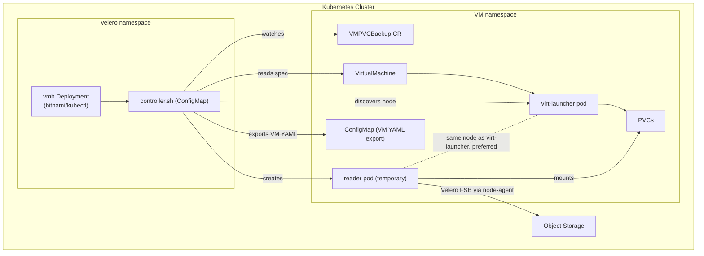
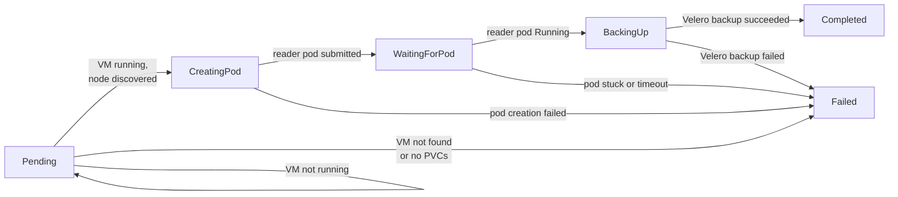
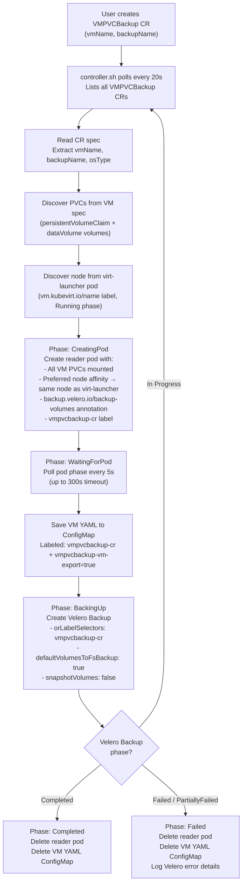
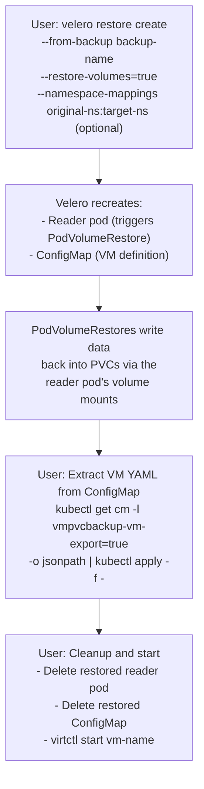
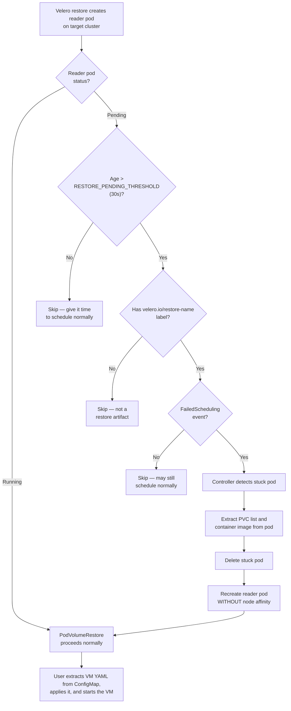
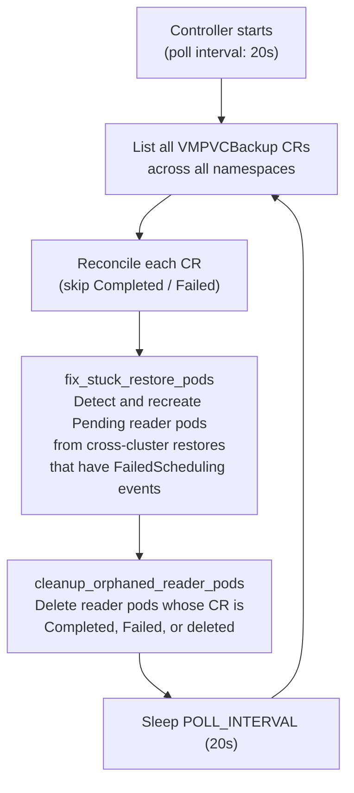

# KubeVirt VM PVC Backup (VMPVCBackup)

A Kubernetes-native controller and CRD for backing up and restoring **running KubeVirt virtual machine** PVCs using Velero file-system backup — without shutting down the VM.

---

## Table of Contents


- [The Problem](#the-problem)
- [How It Works](#architecture-diagram)
  - [Backup Flow](#backup-flow)
  - [Restore Flow](#restore-flow)
  - [Cross-Cluster Restore](#cross-cluster-restore)
- [Architecture Diagram](#architecture-diagram)
- [Prerequisites](#prerequisites)
- [Installation](#installation)
- [Usage](#usage)
  - [Backup a Linux VM](#backup-a-linux-vm)
  - [Backup a Windows VM](#backup-a-windows-vm)
  - [Monitor Backup Progress](#monitor-backup-progress)
  - [Restore](#restore)
- [Resource Reference](#resource-reference)
  - [CustomResourceDefinition — VMPVCBackup](#1-customresourcedefinition--vmpvcbackup)
  - [ServiceAccount, ClusterRole, ClusterRoleBinding — RBAC](#2-serviceaccount-clusterrole-clusterrolebinding--rbac)
  - [ConfigMap — Controller Script](#3-configmap--controller-script)
  - [Deployment — Controller](#4-deployment--controller)
- [Controller Script — Detailed Breakdown](#controller-script--detailed-breakdown)
  - [Global Settings](#global-variables)
  - [Utility Functions](#utility-functions)
  - [Discovery Functions](#discovery-functions)
  - [Resource Labeling Functions](#resource-labeling-functions)
  - [VM YAML Preservation Functions](#vm-yaml-preservation-functions)
  - [Reader Pod Functions](#reader-pod-functions)
  - [Velero Functions](#velero-functions)
  - [Cleanup Functions](#cleanup-functions)
  - [Core Logic](#core-logic)
  - [Main Loop](#main-loop)
- [CR Spec Reference](#cr-spec-reference)
- [Status Fields](#status-fields)
- [Limitations](#limitations)

---

## The Problem

Velero's file-system backup (FSB) requires a **running pod** with the PVC mounted to perform the backup. KubeVirt VMs use PVCs through `virt-launcher` pods, but:

 Velero's FSB cannot back up PVCs mounted by `virt-launcher` pods directly — the pod internals are managed by KubeVirt and don't expose standard mount paths.

**The workaround:** Mount the VM's PVCs onto a temporary **reader pod** on the same node, back up through that pod using Velero FSB, then clean up. This controller automates that entire workflow.

---

## Architecture Diagram

### Cluster Architecture



### CR Status Phases



### Backup Flow



### Restore Flow



### Cross-Cluster Restore



## Main Reconciliation Loop




---

## Prerequisites

| Requirement | Details |
|---|---|
| **Kubernetes** |  |
| **KubeVirt** |  |
| **Velero** | with a file-system backup provider (restic or kopia) |
| **Velero node-agent** | DaemonSet must be running (`velero install --use-node-agent`) |
| **kubectl** | Available on the machine where you apply manifests |
| **virtctl** | (Optional) For starting/stopping VMs |
| **Object storage** | Configured as a Velero BackupStorageLocation (S3, GCS, MinIO, etc.) |

Verify Velero is working:

```bash
# Velero server is running
kubectl get deployment -n velero

# Node-agent is deployed on all nodes
kubectl get daemonset -n velero

# BackupStorageLocation is available
velero backup-location get
```

---

## Installation

**Step 1 — Clone the repository:**

```bash
git clone https://github.com/code-lover636/Kubevirt-VM-Backup.git
cd Kubevirt-VM-Backup
```

**Step 2 — Review the manifest:**

The entire solution is in a single file. Open it and verify the `velero` namespace matches your setup:

```bash
cat vmpvcbackup.yaml
```

**Step 3 — Apply the manifest:**

```bash
kubectl apply -f vmpvcbackup.yaml
```

This creates all four resources at once:
- The `VMPVCBackup` CRD
- RBAC (ServiceAccount, ClusterRole, ClusterRoleBinding)
- The controller script ConfigMap
- The controller Deployment

**Step 4 — Verify the controller is running:**

```bash
kubectl get deployment vmb -n velero
kubectl logs -n velero -l app=vmb -f
```

You should see:

```
[2026-03-26 00:00:00] [INFO]  VMPVCBackup controller started (poll interval: 20s)
```

**Step 5 — Verify the CRD is registered:**

```bash
kubectl get crd vmpvcbackups.backup.kubevirt.io
```

---

## Usage

### Backup a Linux VM

**1. Ensure the VM is running:**

```bash
kubectl get vmi -n <namespace>
```

**2. Create a VMPVCBackup CR:**

```yaml
apiVersion: backup.kubevirt.io/v1alpha1
kind: VMPVCBackup
metadata:
  name: myvm-backup-1         # name of the CR
  namespace: default          # must match the VM's namespace
spec:
  vmName: my-linux-vm         # name of the VirtualMachine object
  backupName: myvm-velero-1   # name for the Velero Backup
```

```bash
kubectl apply -f backup-cr.yaml
```

**3. Watch the logs:**
```bash
kubectl logs -n velero -l app=vmb -f
```


### Backup a Windows VM

```yaml
apiVersion: backup.kubevirt.io/v1alpha1
kind: VMPVCBackup
metadata:
  name: winvm-backup-1
  namespace: vms
spec:
  vmName: my-windows-vm
  backupName: winvm-velero-1
  osType: windows               # uses servercore image + windows mount paths
```

### Monitor Backup Progress

```bash
# CR status (short form)
kubectl get vmpb -A

# Detailed status
kubectl describe vmpvcbackup myvm-backup-1 -n default

# Controller logs
kubectl logs -n velero -l app=vmb -f

# Underlying Velero backup
velero backup describe myvm-velero-1 --details
```

### Restore


```bash
# Step 1 — Create Velero restore
velero restore create --from-backup myvm-velero-1 --restore-volumes=true --wait

# Step 2 — Wait for PodVolumeRestores to complete
kubectl get podvolumerestores -n velero -w

# Step 3 — Recreate the VM from the saved ConfigMap
kubectl get configmap -n default -l vmpvcbackup-vm-export=true \
  -o jsonpath='{.items[0].data.vm\.yaml}' | kubectl apply -f -

# Step 4 — Start the VM
virtctl start my-linux-vm -n default
```
---

## Resource Reference

### 1. CustomResourceDefinition — VMPVCBackup

Registers the `VMPVCBackup` custom resource in the `backup.kubevirt.io` API group. This is the user-facing API — you create a VMPVCBackup object to trigger a backup. The CRD defines the `.spec` fields (vmName, backupName, osType, veleroNamespace) and `.status` fields (phase, readerPodName, targetNode, etc.) along with printer columns so `kubectl get vmpb` shows useful information at a glance.

### 2. ServiceAccount, ClusterRole, ClusterRoleBinding — RBAC

The controller runs as the `vmb` ServiceAccount in the `velero` namespace. The ClusterRole grants it permission to:

- **Get, list, watch** VMPVCBackup CRs and **update, patch** their status subresource
- **Get, list, create, delete, watch** pods (reader pods), PVCs, and ConfigMaps (VM YAML export)
- **Get, list, patch** VirtualMachines and VirtualMachineInstances (for discovering PVCs and node)
- **Get, list** DataVolumes (CDI metadata)
- **Get, list, watch, create** Velero Backups, Restores, and PodVolumeRestores

The ClusterRoleBinding binds this role to the `vmb` ServiceAccount across all namespaces.

### 3. ConfigMap — Controller Script

Contains `controller.sh` — the entire controller logic in a single Bash script. Mounted into the controller pod at `/scripts/controller.sh`. This is where all the automation logic lives: discovery, pod creation, Velero integration, cleanup, and restore assistance.

### 4. Deployment — Controller

A single-replica Deployment in the `velero` namespace that runs the `bitnami/kubectl` image with the controller script. It uses the `vmb` ServiceAccount for API access. The pod mounts the script ConfigMap and simply executes `controller.sh` as its entrypoint.

---

## Controller Script — Detailed Breakdown

The controller is a polling-based reconciliation loop written in Bash. Every 20 seconds it lists all VMPVCBackup CRs, reconciles each one, then runs restore-assist and orphan cleanup.


### Global Variables

| Variable | Default | Description |
|---|---|---|
| `POLL` | `20` | Seconds between each reconciliation cycle |
| `POD_TIMEOUT` | `300` | Max seconds to wait for reader pod to reach `Running` state |

---

### Utility Functions

#### `log(level, message)`

Prints a timestamped log line to stdout.

| Param | Type | Description |
|---|---|---|
| `level` | string | Log level — `INFO`, `WARN`, or `ERROR` |
| `message` | string | Message to print |

**Output format:**
```
[2026-03-26 11:02:10] [INFO] Controller started
```

---

#### `set_status(name, ns, phase, msg)`

Patches the `.status.phase` and `.status.message` fields on a VMPVCBackup CR using a JSON merge patch on the status subresource.

| Param | Type | Description |
|---|---|---|
| `name` | string | Name of the VMPVCBackup CR |
| `ns` | string | Namespace of the CR |
| `phase` | string | One of: `Pending`, `BackingUp`, `Completed`, `Failed` |
| `msg` | string | Human-readable status message |

**Behavior:** Logs the status transition before patching. If the patch fails (e.g. RBAC issue), logs a warning but does not halt the controller.

---

### Discovery Functions

#### `get_vm_pvcs(vm, ns)`

Discovers all PVCs attached to a VirtualMachine by reading its spec.

| Param | Type | Description |
|---|---|---|
| `vm` | string | Name of the VirtualMachine object |
| `ns` | string | Namespace of the VM |

**Returns:** Space-separated string of unique PVC names printed to stdout.

**How it works:** Reads two jsonpath fields from the VM spec:
- `.spec.template.spec.volumes[*].persistentVolumeClaim.claimName` — direct PVC references
- `.spec.template.spec.volumes[*].dataVolume.name` — CDI DataVolume references (DataVolume name equals PVC name)

Combines both, removes duplicates with `sort -u`, and returns the result.

---

#### `get_vm_node(vm, ns)`

Finds the Kubernetes node where the VM is currently running.

| Param | Type | Description |
|---|---|---|
| `vm` | string | Name of the VirtualMachine object |
| `ns` | string | Namespace of the VM |

**Returns:** Node name printed to stdout, or empty string if VM is not running.

**How it works:** Looks up the `virt-launcher` pod using label `vm.kubevirt.io/name=<vm>` filtered to `status.phase=Running`, and extracts `.spec.nodeName` from the first match.

---

### Resource Labeling Functions

#### `label_resources(label, ns, pvcs...)`

Adds the `vmpvcbackup-cr=<label>` label to PVCs and their corresponding DataVolumes. This label is what Velero's `orLabelSelectors` matches to include these resources in the backup.

| Param | Type | Description |
|---|---|---|
| `label` | string | Label value — set to the reader pod name |
| `ns` | string | Namespace of the resources |
| `pvcs...` | string(s) | One or more PVC names |

**Behavior:** Iterates over each PVC name and labels both the PVC and the DataVolume with the same name (if it exists). DataVolume labeling failures are silently ignored since not every PVC has a corresponding DataVolume.

---

#### `unlabel_resources(ns, pvcs...)`

Removes the `vmpvcbackup-cr` label from PVCs and DataVolumes after backup completes or fails.

| Param | Type | Description |
|---|---|---|
| `ns` | string | Namespace of the resources |
| `pvcs...` | string(s) | One or more PVC names |

**Behavior:** Uses the `label-` syntax (`vmpvcbackup-cr-`) to remove the label. All failures are silently ignored — resources may have already been cleaned up or may not exist.

---

### VM YAML Preservation Functions

#### `save_vm_configmap(vm, ns, label)`

Exports the full VirtualMachine YAML to a ConfigMap so it can be restored without including `virtualmachines` in Velero's `includedResources` (which would trigger kubevirt-velero-plugin errors on running VMs).

| Param | Type | Description |
|---|---|---|
| `vm` | string | Name of the VirtualMachine object |
| `ns` | string | Namespace of the VM |
| `label` | string | Label value — used for both the ConfigMap name and the Velero selector label |

**Creates:** A ConfigMap named `vm-yaml-<label>` with:
- Key `vm.yaml` containing the full VM YAML
- Label `vmpvcbackup-cr=<label>` — so Velero includes it in the backup
- Label `vmpvcbackup-vm-export=true` — so the restore process can find it

**How it works:** Uses `kubectl create configmap --dry-run=client` piped through `kubectl label --local` piped through `kubectl apply` to create the ConfigMap with labels in a single atomic operation.

---

#### `delete_vm_configmap(label, ns)`

Deletes the VM YAML ConfigMap after backup completes.

| Param | Type | Description |
|---|---|---|
| `label` | string | Label value used when creating the ConfigMap |
| `ns` | string | Namespace |

**Deletes:** ConfigMap named `vm-yaml-<label>`. Uses `--ignore-not-found` so it doesn't fail if already deleted.

---

### Reader Pod Functions

#### `create_reader_pod(pod, ns, os, node, pvcs...)`

Creates a temporary pod that mounts all VM PVCs so Velero can perform file-system backup through it.

| Param | Type | Description |
|---|---|---|
| `pod` | string | Name for the reader pod |
| `ns` | string | Namespace to create the pod in |
| `os` | string | `linux` or `windows` — determines image, mount paths, and security context |
| `node` | string | Target node — used as a preferred (not required) scheduling hint |
| `pvcs...` | string(s) | One or more PVC names to mount |

**Creates a pod with:**

| Feature | Linux | Windows |
|---|---|---|
| Image | `ubuntu:22.04` | `mcr.microsoft.com/windows/servercore:ltsc2022` |
| Command | `sleep infinity` | `PowerShell Start-Sleep` loop |
| Mount paths | `/data1`, `/data2`, ... | `C:/data1`, `C:/data2`, ... |
| Privileged | `true` | `false` |
| nodeSelector | none | `kubernetes.io/os: windows` |

**Key design decisions:**
- Uses `preferredDuringSchedulingIgnoredDuringExecution` node affinity (not `required`). This ensures the pod lands on the same node as the VM during backup (needed for RWO PVCs) but can schedule on any node during a cross-cluster restore where the original node doesn't exist.
- Carries the `backup.velero.io/backup-volumes` annotation listing `disk1,disk2,...` — this tells Velero which volumes to back up using file-system backup.
- Carries the `vmpvcbackup-cr=<pod>` label — this is the selector Velero uses to include the pod in the backup.

**Returns:** 0 on success, 1 if `kubectl apply` fails.

---

#### `wait_pod_running(pod, ns)`

Polls the pod phase every 5 seconds until it reaches `Running`, fails, or times out.

| Param | Type | Description |
|---|---|---|
| `pod` | string | Pod name |
| `ns` | string | Namespace |

**Returns:**
- `0` — pod is `Running`
- `1` — pod entered `Failed`/`Error` state, or `POD_TIMEOUT` (300s) exceeded

---

### Velero Functions

#### `create_velero_backup(backup, ns, label)`

Creates a Velero Backup object that backs up all resources matching the `vmpvcbackup-cr=<label>` label.

| Param | Type | Description |
|---|---|---|
| `backup` | string | Name for the Velero Backup object |
| `ns` | string | Namespace to include in the backup |
| `label` | string | Label value for `orLabelSelectors` matching |

**Backup includes these resource types:**
- `namespaces` — so the namespace is recreated on restore
- `pods` — the reader pod (triggers FSB data restore)
- `persistentvolumeclaims` — PVC Kubernetes objects
- `persistentvolumes` — PV Kubernetes objects
- `configmaps` — VM YAML definition
- `datavolumes` — CDI DataVolume metadata

**Backup settings:**
- `defaultVolumesToFsBackup: true` — uses file-system backup (restic/kopia) for all annotated volumes
- `snapshotVolumes: false` — no CSI snapshots
- `orLabelSelectors` — only backs up resources with the matching label, not everything in the namespace

**Returns:** 0 on success, 1 if `kubectl apply` fails.

---

### Cleanup Functions

#### `cleanup(pod, ns, pvcs...)`

Performs full cleanup after a backup completes or fails. Calls three sub-operations in sequence.

| Param | Type | Description |
|---|---|---|
| `pod` | string | Reader pod name |
| `ns` | string | Namespace |
| `pvcs...` | string(s) | PVC names to unlabel |

**Actions:**
1. Deletes the reader pod (`--grace-period=30`, `--wait=false`)
2. Deletes the VM YAML ConfigMap via `delete_vm_configmap`
3. Removes backup labels from PVCs and DataVolumes via `unlabel_resources`

---

#### `cleanup_orphans()`

Sweeps all namespaces for reader pods that should have been deleted but weren't — for example due to controller restarts or edge cases.

**Takes no parameters.**

**How it works:**
1. Lists all pods with label `app=vmpvcbackup-reader` across all namespaces
2. For each pod, derives the CR name by stripping the `reader-` prefix from the pod name
3. Looks up the CR's phase in the pod's namespace
4. If the CR is `Completed`, `Failed`, or `NotFound` (deleted) → deletes the orphaned reader pod

**Runs:** Every reconciliation cycle, after all CRs have been processed.

---
### Core Logic

#### `reconcile(name, ns)`

The main function that processes a single VMPVCBackup CR. Called once per CR per poll cycle.

|Param|Type|Description|
|---|---|---|
|`name`|string|Name of the VMPVCBackup CR|
|`ns`|string|Namespace of the CR|

**Flow:**

```
START
  │
  ├─ Phase is Completed or Failed? ──→ SKIP (return 0)
  │
  ├─ Read spec: vmName, backupName, osType
  │  └─ Missing vmName or backupName? ──→ FAILED
  │
  ├─ Discover PVCs from VM spec
  │
  ├─ Velero backup already exists? ──→ CHECK RESULT
  │  │                                   ├─ Completed → cleanup + COMPLETED
  │  │                                   ├─ Failed    → cleanup + FAILED
  │  │                                   └─ Other     → BACKING UP (wait)
  │  │
  │  ▼
  │  BACKUP DOES NOT EXIST — full pipeline:
  │
  ├─ Verify VM exists ──────────────→ FAILED if not found
  ├─ Verify PVCs found ─────────────→ FAILED if empty
  ├─ Discover node ──────────────────→ PENDING if VM not running
  ├─ Delete old reader pod (if any)
  ├─ Create reader pod
  ├─ Wait for pod Running ──────────→ FAILED on timeout
  ├─ Label PVCs and DataVolumes
  ├─ Save VM YAML to ConfigMap
  ├─ Create Velero Backup ──────────→ FAILED on error
  └─ Set phase to BackingUp
      (next cycle will check the result)
```

---

### Main Loop

```bash
while true; do
    for each VMPVCBackup CR across all namespaces:
        reconcile(name, namespace)

    cleanup_orphans()

    sleep POLL seconds
done
```

The controller runs as an infinite polling loop. Every `POLL` seconds (default 20), it lists all VMPVCBackup CRs across all namespaces and reconciles each one. After processing all CRs, it runs a single orphan sweep pass to clean up any stale reader pods. Terminal CRs (`Completed`/`Failed`) are skipped immediately with no API calls beyond the initial phase check.

---

## CR Spec Reference

| Field | Type | Required | Default | Description |
|---|---|---|---|---|
| `spec.vmName` | string | Yes | — | Name of the VirtualMachine to back up |
| `spec.backupName` | string | Yes | — | Name to give the Velero Backup object |
| `spec.veleroNamespace` | string | No | `velero` | Namespace where Velero is installed |
| `spec.osType` | string | No | `linux` | `linux` or `windows` — determines reader pod image and mount paths |

## Status Fields

| Field | Description |
|---|---|
| `status.phase` | Current state: `Pending`, `CreatingPod`, `WaitingForPod`, `BackingUp`, `Completed`, `Failed` |
| `status.readerPodName` | Name of the temporary reader pod |
| `status.targetNode` | Node where the virt-launcher (and reader pod) runs |
| `status.veleroBackupName` | Name of the Velero Backup object |
| `status.discoveredPVCs` | Space-separated list of discovered PVC names |
| `status.message` | Human-readable status message |

---

## Limitations

- **RWO PVC node co-location** — The reader pod uses `preferredDuringSchedulingIgnoredDuringExecution` node affinity targeting the same node as the virt-launcher pod. For RWO PVCs, Kubernetes enforces co-location anyway, but if the target node has insufficient resources to schedule the reader pod alongside the VM, the pod will remain unschedulable.
