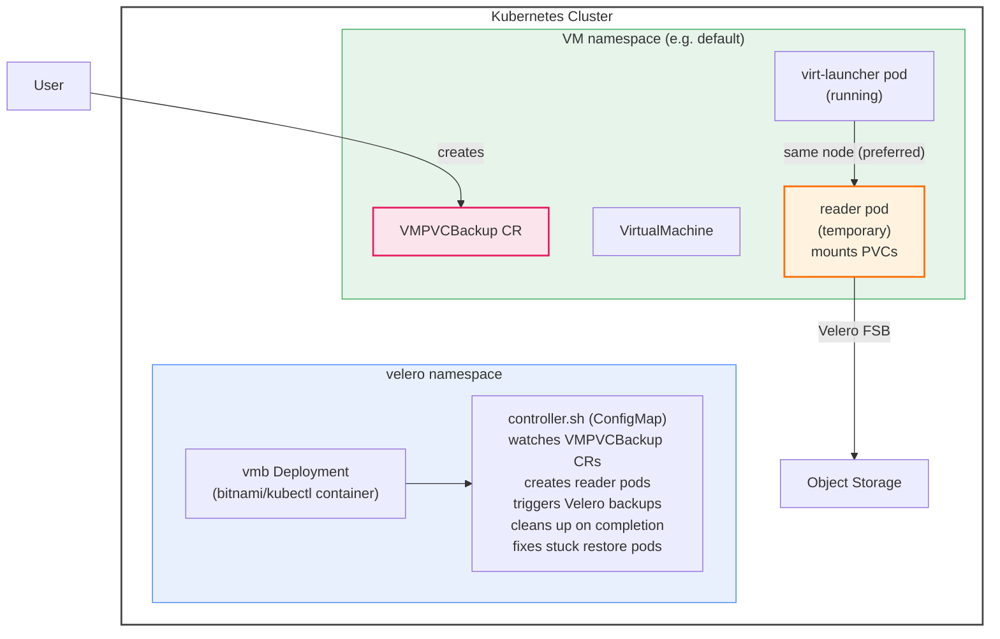
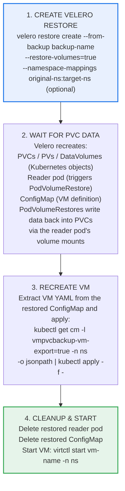
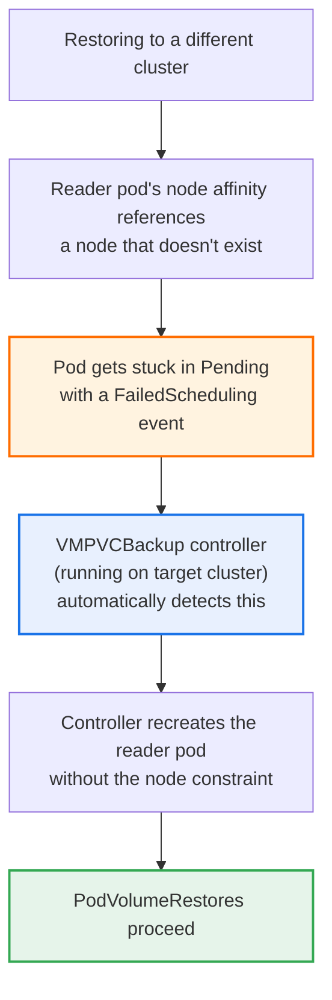

# Architecture Diagrams

## Cluster Architecture

```mermaid
graph TB
    subgraph cluster["Kubernetes Cluster"]

        subgraph velero-ns["velero namespace"]
            DEP["vmb Deployment<br/>(bitnami/kubectl container)"]
            CM["controller.sh (ConfigMap)<br/>watches VMPVCBackup CRs<br/>creates reader pods<br/>triggers Velero backups<br/>cleans up on completion<br/>fixes stuck restore pods"]
            DEP --> CM
        end

        subgraph vm-ns["VM namespace (e.g. default)"]
            CRD["VMPVCBackup CR"]
            VM["VirtualMachine"]
            VMI["virt-launcher pod<br/>(running)"]
            READER["reader pod<br/>(temporary)<br/>mounts PVCs"]
            VMI -- "same node (preferred)" --> READER
        end

        READER -- "Velero FSB" --> OS

    end

    OS["Object Storage"]
    USER["User"] -- "creates" --> CRD

    style cluster fill:none,stroke:#444,stroke-width:2px
    style velero-ns fill:#e8f0fe,stroke:#4285f4,stroke-width:1px
    style vm-ns fill:#e6f4ea,stroke:#34a853,stroke-width:1px
    style READER fill:#fff3e0,stroke:#ff6d00,stroke-width:2px
    style CRD fill:#fce4ec,stroke:#e91e63,stroke-width:2px
```

## Backup Flow

```mermaid
flowchart TD
    A["User creates a VMPVCBackup CR<br/>vmName: my-vm &nbsp; backupName: my-backup"] --> B

    B["1. DISCOVER<br/>Controller reads the VM spec and discovers:<br/>All PVCs (from persistentVolumeClaim + dataVolume volumes)<br/>The node where virt-launcher is running"] --> C

    C["2. CREATE READER POD<br/>A lightweight pod (ubuntu:22.04 / servercore:ltsc2022) is created with:<br/>All VM PVCs mounted as volumes<br/>Preferred node affinity → same node as virt-launcher<br/>backup.velero.io/backup-volumes annotation<br/>vmpvcbackup-cr label for Velero selection"] --> D

    D["3. LABEL RESOURCES<br/>PVCs and DataVolumes are labeled with vmpvcbackup-cr<br/>so Velero's orLabelSelectors picks them up<br/>as Kubernetes objects"] --> E

    E["4. SAVE VM DEFINITION<br/>The full VM YAML is exported to a ConfigMap (also labeled)<br/>so it can be recreated during restore without needing<br/>the virtualmachines resource in the Velero backup"] --> F

    F["5. TRIGGER VELERO BACKUP<br/>A Velero Backup is created that selects resources by label:<br/>Reader pod → FSB writes PVC data to object storage<br/>PVCs / PVs → Kubernetes objects preserved<br/>DataVolumes → CDI metadata preserved<br/>ConfigMap → VM definition preserved"] --> G

    G["6. CLEANUP<br/>Once Velero reports Completed or Failed:<br/>Reader pod is deleted<br/>VM YAML ConfigMap is deleted<br/>Backup labels are removed from PVCs / DataVolumes<br/>CR status is updated to Completed / Failed"]

    style A fill:#e8f0fe,stroke:#1a73e8,stroke-width:2px
    style G fill:#e6f4ea,stroke:#34a853,stroke-width:2px
```

## Restore Flow

```mermaid
flowchart TD
    A["1. CREATE VELERO RESTORE<br/>velero restore create --from-backup backup-name<br/>--restore-volumes=true<br/>--namespace-mappings original-ns:target-ns (optional)"] --> B

    B["2. WAIT FOR PVC DATA<br/>Velero recreates:<br/>PVCs / PVs / DataVolumes (Kubernetes objects)<br/>Reader pod (triggers PodVolumeRestore)<br/>ConfigMap (VM definition)<br/>PodVolumeRestores write data back into PVCs<br/>via the reader pod's volume mounts"] --> C

    C["3. RECREATE VM<br/>Extract VM YAML from the restored ConfigMap and apply:<br/>kubectl get cm -l vmpvcbackup-vm-export=true -n ns<br/>-o jsonpath | kubectl apply -f -"] --> D

    D["4. CLEANUP & START<br/>Delete restored reader pod<br/>Delete restored ConfigMap<br/>Start VM: virtctl start vm-name -n ns"]

    style A fill:#e8f0fe,stroke:#1a73e8,stroke-width:2px
    style D fill:#e6f4ea,stroke:#34a853,stroke-width:2px
```

## Cross-Cluster Restore

```mermaid
flowchart TD
    A["Restoring to a different cluster"] --> B
    B["Reader pod's node affinity references<br/>a node that doesn't exist"] --> C
    C["Pod gets stuck in Pending<br/>with a FailedScheduling event"] --> D
    D["VMPVCBackup controller<br/>(running on target cluster)<br/>automatically detects this"] --> E
    E["Controller recreates the reader pod<br/>without the node constraint"] --> F
    F["PodVolumeRestores proceed"]

    style C fill:#fff3e0,stroke:#ff6d00,stroke-width:2px
    style D fill:#e8f0fe,stroke:#1a73e8,stroke-width:2px
    style F fill:#e6f4ea,stroke:#34a853,stroke-width:2px
```
