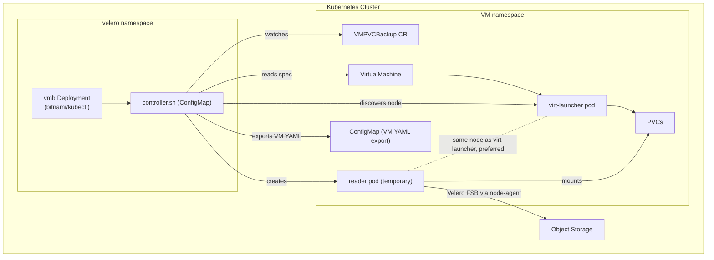
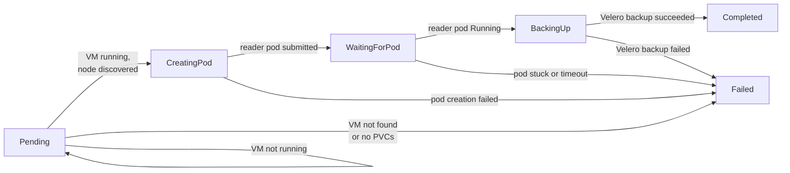
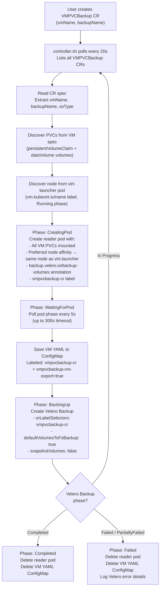
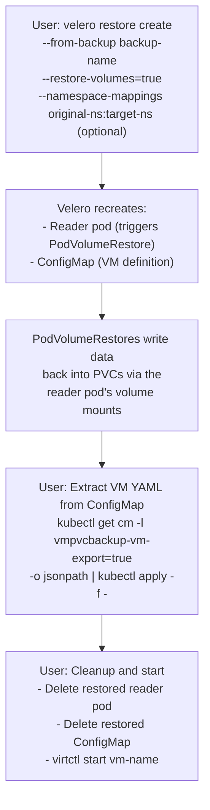
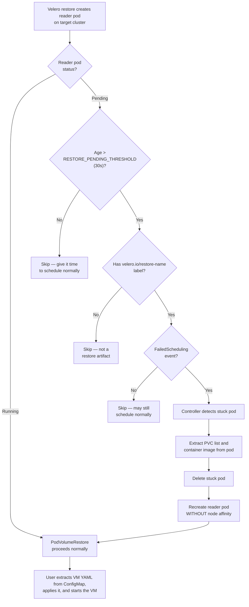
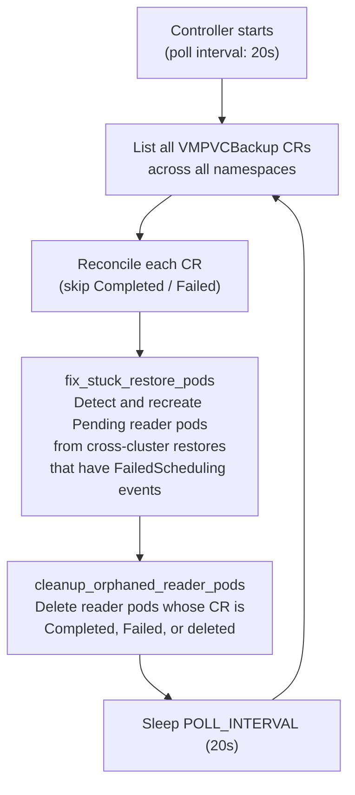

# Architecture Diagrams

## Cluster Architecture

```mermaid
graph TB
    subgraph cluster["Kubernetes Cluster"]

        subgraph velero-ns["velero namespace"]
            DEP["vmb Deployment<br/>(bitnami/kubectl)"]
            CM["controller.sh (ConfigMap)"]
            DEP --> CM
        end

        subgraph vm-ns["VM namespace"]
            CRD["VMPVCBackup CR"]
            VM["VirtualMachine"]
            VMI["virt-launcher pod"]
            PVC["PVCs"]
            READER["reader pod (temporary)"]
            VMCM["ConfigMap (VM YAML export)"]
            VM --> VMI
            VMI --> PVC
            READER -->|mounts| PVC
        end

        OS["Object Storage"]

        CM -->|watches| CRD
        CM -->|reads spec| VM
        CM -->|discovers node| VMI
        CM -->|creates| READER
        CM -->|exports VM YAML| VMCM
        READER -->|Velero FSB via node-agent| OS
    end

    READER -.-|same node as virt-launcher, preferred| VMI
```

## CR Status Phases

```mermaid
flowchart LR
    A["Pending"] -->|VM running,<br/>node discovered| B["CreatingPod"]
    A -->|VM not found<br/>or no PVCs| F["Failed"]
    A -->|VM not running| A

    B -->|reader pod submitted| C["WaitingForPod"]
    B -->|pod creation failed| F

    C -->|reader pod Running| D["BackingUp"]
    C -->|pod stuck or timeout| F

    D -->|Velero backup succeeded| E["Completed"]
    D -->|Velero backup failed| F
```

## Backup Flow

```mermaid
flowchart TD
    U["User creates VMPVCBackup CR<br/>(vmName, backupName)"]
    U --> POLL

    POLL["controller.sh polls every 20s<br/>Lists all VMPVCBackup CRs"]
    POLL --> READ

    READ["Read CR spec<br/>Extract vmName, backupName, osType"]
    READ --> DISC_PVC

    DISC_PVC["Discover PVCs from VM spec<br/>(persistentVolumeClaim + dataVolume volumes)"]
    DISC_PVC --> DISC_NODE

    DISC_NODE["Discover node from virt-launcher pod<br/>(vm.kubevirt.io/name label, Running phase)"]
    DISC_NODE --> CREATE

    CREATE["Phase: CreatingPod<br/>Create reader pod with:<br/>- All VM PVCs mounted<br/>- Preferred node affinity → same node as virt-launcher<br/>- backup.velero.io/backup-volumes annotation<br/>- vmpvcbackup-cr label"]
    CREATE --> WAIT

    WAIT["Phase: WaitingForPod<br/>Poll pod phase every 5s<br/>(up to 300s timeout)"]
    WAIT --> SAVE

    SAVE["Save VM YAML to ConfigMap<br/>Labeled: vmpvcbackup-cr + vmpvcbackup-vm-export=true"]
    SAVE --> TRIGGER

    TRIGGER["Phase: BackingUp<br/>Create Velero Backup<br/>- orLabelSelectors: vmpvcbackup-cr<br/>- defaultVolumesToFsBackup: true<br/>- snapshotVolumes: false"]
    TRIGGER --> RESULT

    RESULT{"Velero Backup<br/>phase?"}
    RESULT -->|Completed| CLEANUP_OK
    RESULT -->|Failed / PartiallyFailed| CLEANUP_FAIL
    RESULT -->|In Progress| POLL

    CLEANUP_OK["Phase: Completed<br/>Delete reader pod<br/>Delete VM YAML ConfigMap"]
    CLEANUP_FAIL["Phase: Failed<br/>Delete reader pod<br/>Delete VM YAML ConfigMap<br/>Log Velero error details"]
```

## Restore Flow

```mermaid
flowchart TD
    A["User: velero restore create<br/>--from-backup backup-name<br/>--restore-volumes=true<br/>--namespace-mappings original-ns:target-ns (optional)"]
    A --> B

    B["Velero recreates:<br/>- Reader pod (triggers PodVolumeRestore)<br/>- ConfigMap (VM definition)"]
    B --> C

    C["PodVolumeRestores write data<br/>back into PVCs via the<br/>reader pod's volume mounts"]
    C --> D

    D["User: Extract VM YAML from ConfigMap<br/>kubectl get cm -l vmpvcbackup-vm-export=true<br/>-o jsonpath | kubectl apply -f -"]
    D --> E

    E["User: Cleanup and start<br/>- Delete restored reader pod<br/>- Delete restored ConfigMap<br/>- virtctl start vm-name"]
```

## Cross-Cluster Restore

```mermaid
flowchart TD
    A["Velero restore creates reader pod<br/>on target cluster"] --> B{"Reader pod<br/>status?"}

    B -->|Running| OK["PodVolumeRestore<br/>proceeds normally"]

    B -->|Pending| C{"Age ><br/>RESTORE_PENDING_THRESHOLD<br/>(30s)?"}
    C -->|No| WAIT["Skip — give it time<br/>to schedule normally"]
    C -->|Yes| D{"Has velero.io/restore-name<br/>label?"}
    D -->|No| SKIP1["Skip — not a<br/>restore artifact"]
    D -->|Yes| E{"FailedScheduling<br/>event?"}
    E -->|No| SKIP2["Skip — may still<br/>schedule normally"]
    E -->|Yes| F["Controller detects stuck pod"]
    F --> G["Extract PVC list and<br/>container image from pod"]
    G --> H["Delete stuck pod"]
    H --> I["Recreate reader pod<br/>WITHOUT node affinity"]
    I --> OK

    OK --> J["User extracts VM YAML from ConfigMap,<br/>applies it, and starts the VM"]
```

## Main Reconciliation Loop

```mermaid
flowchart TD
    START["Controller starts<br/>(poll interval: 20s)"] --> LIST

    LIST["List all VMPVCBackup CRs<br/>across all namespaces"] --> RECONCILE

    RECONCILE["Reconcile each CR<br/>(skip Completed / Failed)"] --> RESTORE

    RESTORE["fix_stuck_restore_pods<br/>Detect and recreate Pending reader pods<br/>from cross-cluster restores<br/>that have FailedScheduling events"] --> ORPHAN

    ORPHAN["cleanup_orphaned_reader_pods<br/>Delete reader pods whose CR is<br/>Completed, Failed, or deleted"] --> SLEEP

    SLEEP["Sleep POLL_INTERVAL (20s)"] --> LIST
```
